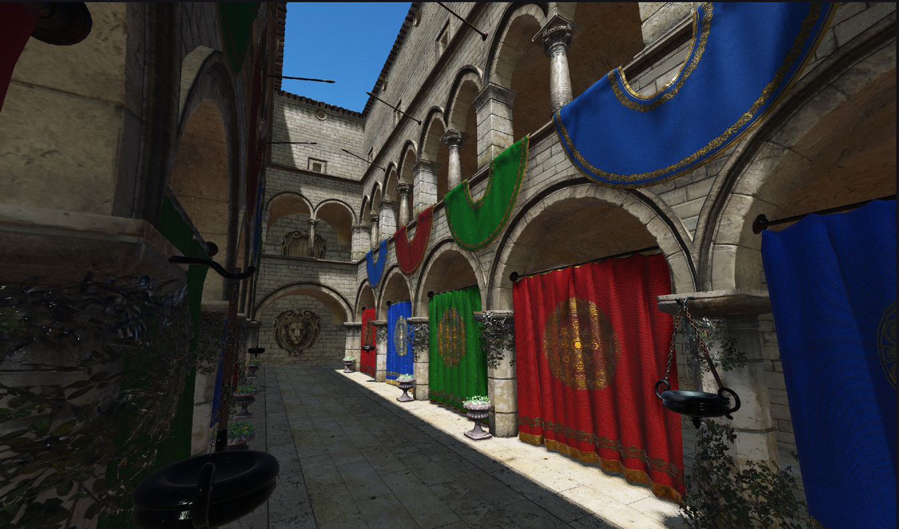
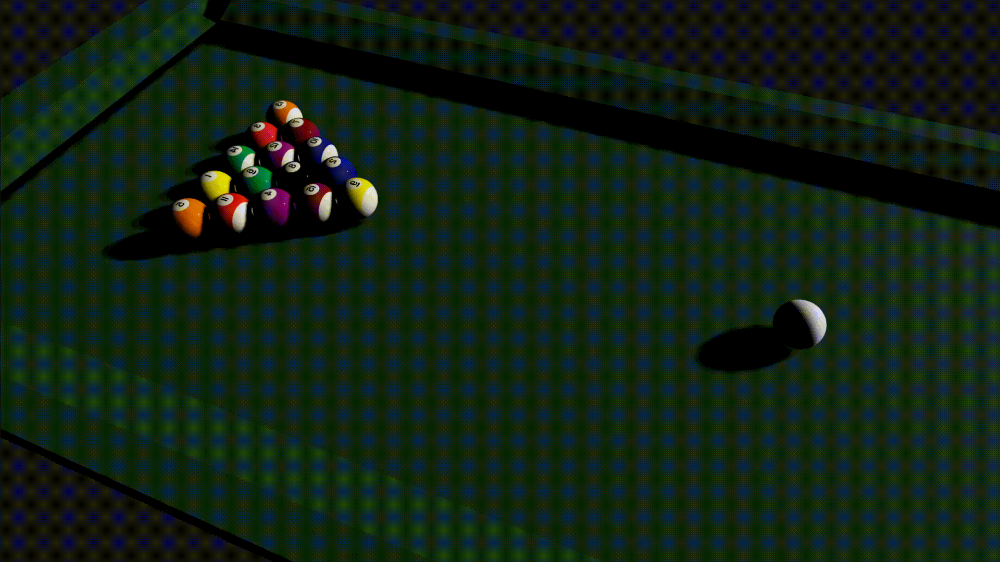

    

# Project Acinonyx

Acinonyx is a cross platform game engine based on C++23 and Vulkan, it features Forward Rendering, Physically Based Shading, Shadows, Physics, glTF support and more.
The project is actively beeing developed on spare time as a side project to study and explore modern real time 3D technologies.

Some future improvements will be Forward+ Rendering, Hybrid Rendering, Light Probes, Ray Traced Global Illumination and Ambient Occlusion, Animations and much more. And obviously as the name implies, the main goal is to be stupidly fast and over-optimized.

|||
-|-
| | 


## Build instructions
> ### Prerequisites
> #### Premake 5
> Install through your favourite package manager or download from https://github.com/premake/premake-core/releases
> #### Vulkan SDK
> Available at https://vulkan.lunarg.com/sdk/home

After setting up the dependencies go to the main repository folder and execute the premake script to create the project files for your favourite platform
```bash
# macOS
premake5 xcode4

# Windows
premake5 vs2022

# Linux (a premake extension is available to use ninja instead of make)
premake5 make
```